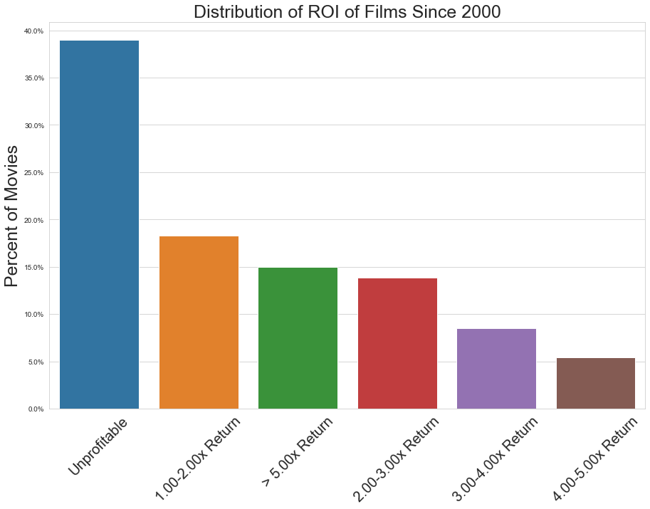
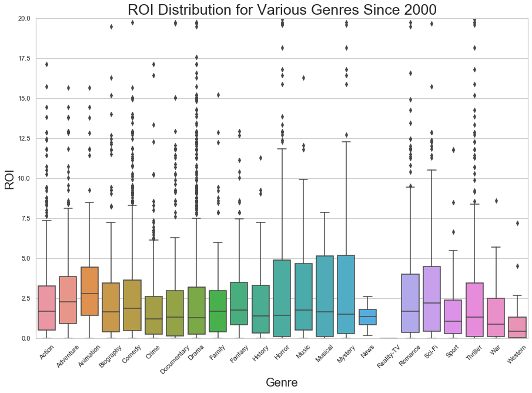
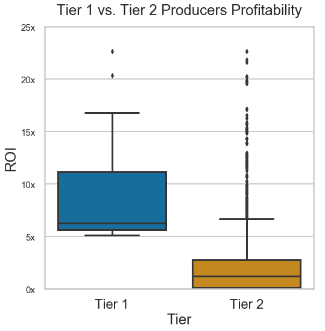
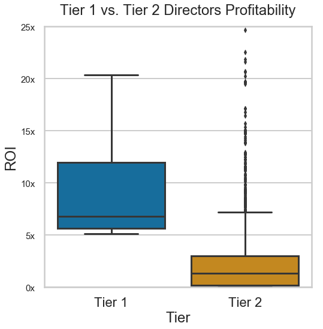
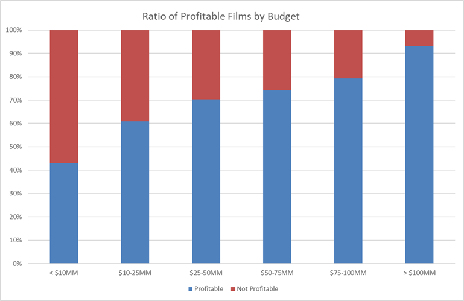

# Maximizing ROI in Film Production

## Table of Contents
* [General Info](#general-info)
* [Technologies](#technologies)
* [Insights and Business Recommendations](#insights-and-business-recommendations)
* [Further Studies](#further-studies)

## General Info
This project was assigned as the final project for Module 1 (Data Analysis) in Flatiron School's Immersive Data Science Program. The project centers around a hypothetical scenario in which Microsoft is interested in entering the movie production business. As a data scientist I have been tasked with analyzing public movie databases (Rotten Tomatoes, IMDB, TMDB, and Box Office Mojo) and determining what makes a financially successful film. 

It was my decision to use return on investment as the primary metric for financial success. This allows us to disregard the effects of inflation and equally compare high budget and low budget films. A major assumption in this analysis is that Microsoft's distribution model is to premier these films in theaters where they will earn most of their revenue. Furthermore, I am electing to narrow my study down to only modern films since the year 2000. 

Basic analyses show that making a profitable film is difficult. 

## Technologies
This project was created using the following languages and libraries. An environment with the correct versions of the following libraries will allow re-production and improvement on this project. 

* Python version: 3.6.9
* Matplotlib version: 3.0.3
* Seaborn version: 0.9.0
* Pandas version: 0.24.2
* Sqlite3 version: 2.6.0
* Numpy version: 1.16.2

## Insights and Business Recommendations

### Pick the Right Genre of Films to Produce
There are many different genre of films available to produce and they do not all offer similar returns. As the boxplots below show, there is a very wide distribution of ROI's based on the various genres. Based on the data available **the movie genres which offer the best ROI are Animation, Adventure, and Sci-Fi.** These are also the only three genres which offer a median ROI over 2.00x. 

### Hire Great People to Make Them
Though I know very little about the film industry basic domain research has taught me that who you hire to make your film, especially producers and directors, have a very strong effect on the profitability of your film. For this section of the project I sought to figure out who the *best* producers and directors are in the industry based on the median ROI of their films. I sought out directors and producers which had produced or directed at least three recent films (for which I had financial data available) which had a median ROI over 5.00x. 

These criteria narrowed down my 1,682 person producer list and 615 person director list to 189 and 108 people, respectively. These lists are available in the student.ipynb for viewing and are the candidate I'd recommend investigating further. The boxplots below show the comparative distributions of the "Tier 1" (those who made our select list) and "Tier 2" (all) categories of directors and producers. 

**Top Producers**

**Top Directors**

### Don't Skimp on the Budget
Finally, I sought to determine which budget films lead to profitable films most often. As the plot below show, the more you spend on a given film, the more likely it is to be profitable.

## Further Studies
Though we made some great insights during this project there are several advanced steps we may take which could bring us closer to our goal of becoming a successful studio. 

### Dive Deeper Into Movie Finances
Hollywood has proven to be notorious for skewing, or otherwise being secretive about, the financial data of their films. One problem with the data we had available in this study is that we are only given the production budget for these movies. While useful this number does not account for other expenses relating to distribution such as the theater's cut, advertising, and marketing. Given more reliable financial data which includes promotional budgets, as well as perhaps other sources of revenue such as instant video rentals, would help us better understand what make profitable films. 

### Clarify Distribution Model
Answering the question "what type of movies should we be producing" in this analysis depends on the very important assumption that Microsoft intends on producing these movies with the intent to premier them in theaters where they will make the majority of their revenue. The success metrics would likely be very different if the goal were to say - launch a subscriber based video streaming service. If that were the case then a likely success metric would be viewer counts, or movie popularity to put it more broadly. In which case then it would be time to search for the best metrics for determining the "trending-worthiness" of a movie or mini series. 

### Preferred Genres of Directors / Producers
It would be helpful to analyze what type of movies our chosen producers / directors are accustomed to working on. Furthermore, we could look at our most profitable genres and see which directors and producers have the most experience working on films of each genre.
